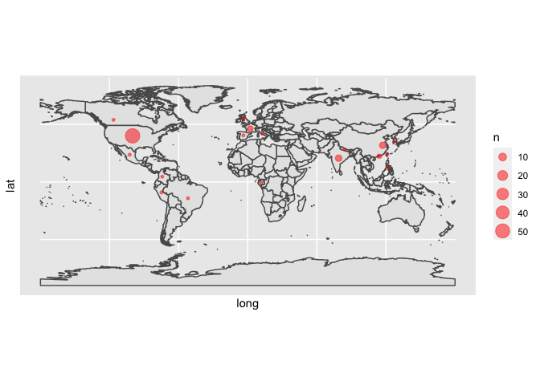

Untitled
================

read csv
========

``` r
suppressPackageStartupMessages(library(tidyverse))
suppressPackageStartupMessages(library(knitr))
lab <- read_csv("Lab_members_stats_Feschotte.csv")
```

    ## Parsed with column specification:
    ## cols(
    ##   Name = col_character(),
    ##   Country = col_character(),
    ##   Race = col_character(),
    ##   Gender = col_character(),
    ##   Position = col_character(),
    ##   Start = col_double(),
    ##   End = col_character(),
    ##   `Institution (primary, when in lab)` = col_character(),
    ##   `Fellowship/Awards` = col_logical(),
    ##   lat = col_double(),
    ##   long = col_double(),
    ##   number = col_double()
    ## )

``` r
lab
```

    ## # A tibble: 84 x 12
    ##    Name  Country Race  Gender Position Start End   `Institution (p…
    ##    <chr> <chr>   <chr> <chr>  <chr>    <dbl> <chr> <chr>           
    ##  1 Maur… Brazil  Lati… M      VS          NA <NA>  Utah            
    ##  2 Luc … Canada  Asian M      RS        2020 2020  Cornell         
    ##  3 Xiao… China   Asian M      GS          NA <NA>  Utah            
    ##  4 Qi W… China   Asian M      GS          NA <NA>  UTArlington     
    ##  5 Sun … China   Asian M      PD          NA <NA>  UTArlington     
    ##  6 Rene… China   Asian F      US        2017 2020  Cornell         
    ##  7 Xiji… China   Asian F      US        2018 2018  Cornell         
    ##  8 Min-… China   Asian M      VS        2018 2019  Cornell         
    ##  9 Fabi… Colomb… Lati… M      US        2019 now   Cornell         
    ## 10 Clém… France  White M      PD        2016 now   Cornell         
    ## # … with 74 more rows, and 4 more variables: `Fellowship/Awards` <lgl>,
    ## #   lat <dbl>, long <dbl>, number <dbl>

world map
=========

``` r
library("rnaturalearth") # install.packages("rnaturalearth")
library("rnaturalearthdata") # install.packages("rnaturalearthdata")
library("rgeos") #install.packages("rgeos")
```

    ## Loading required package: sp

    ## rgeos version: 0.5-5, (SVN revision 640)
    ##  GEOS runtime version: 3.8.1-CAPI-1.13.3 
    ##  Linking to sp version: 1.4-1 
    ##  Polygon checking: TRUE

``` r
lab %>% 
  group_by(Country,lat,long) %>% 
  summarize(n=n())
```

    ## # A tibble: 18 x 4
    ## # Groups:   Country, lat [18]
    ##    Country            lat    long     n
    ##    <chr>            <dbl>   <dbl> <int>
    ##  1 Brazil         -14.2    -51.9      1
    ##  2 Canada          53.9   -117.       1
    ##  3 China           31.8    117.       6
    ##  4 Colombia         4.57   -74.3      1
    ##  5 France          46.2      2.21     4
    ##  6 Gabon           -0.804   11.6      1
    ##  7 Hong Kong       22.3    114.       2
    ##  8 India           20.6     79.0      6
    ##  9 Italy           41.9     12.6      1
    ## 10 Mexico          23.6   -103.       1
    ## 11 Nepal           28.2     84.2      1
    ## 12 Peru            -9.19   -75.0      1
    ## 13 Philipine       12.9    122.       1
    ## 14 South Korea     35.9    128.       1
    ## 15 Spain           40.5     -3.75     1
    ## 16 Taiwan          23.7    121        1
    ## 17 United Kingdom  55.4     -3.44     1
    ## 18 United States   40     -100       53

``` r
world <- ne_countries(scale = "medium", returnclass = "sf")
lab %>% 
  group_by(Country,lat,long) %>% 
  summarize(n=n()) %>% 
  ggplot() +
  geom_sf(data = world) +
  geom_point(aes(x=long, y=lat, size=n,color=6*n), color="red", fill="red", alpha=0.8, shape=21)+
  scale_size(range=c(1,10),breaks=c(1,5,10,20,50)) +
  labs(title= "Feschotte Lab Diversity", subtitle="From 2014-2020")+
  theme(panel.grid = element_blank())
```



``` r
  theme(axis.title.y = element_blank(), axis.title.x = element_blank())
```

    ## List of 2
    ##  $ axis.title.x: list()
    ##   ..- attr(*, "class")= chr [1:2] "element_blank" "element"
    ##  $ axis.title.y: list()
    ##   ..- attr(*, "class")= chr [1:2] "element_blank" "element"
    ##  - attr(*, "class")= chr [1:2] "theme" "gg"
    ##  - attr(*, "complete")= logi FALSE
    ##  - attr(*, "validate")= logi TRUE
