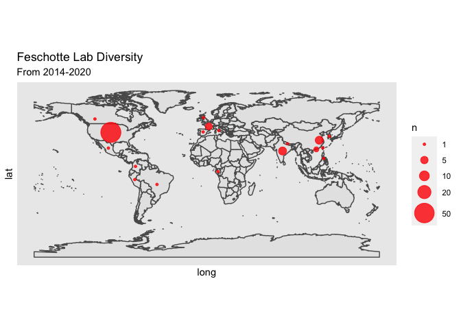

Untitled
================

read csv
========

``` r
suppressPackageStartupMessages(library(tidyverse))
suppressPackageStartupMessages(library(knitr))
lab <- read_csv("Lab_members_stats_Feschotte.csv")
```

    ## Parsed with column specification:
    ## cols(
    ##   Name = col_character(),
    ##   Country = col_character(),
    ##   Race = col_character(),
    ##   Gender = col_character(),
    ##   Position = col_character(),
    ##   Start = col_double(),
    ##   End = col_character(),
    ##   `Institution (primary, when in lab)` = col_character(),
    ##   `Fellowship/Awards` = col_logical(),
    ##   lat = col_double(),
    ##   long = col_double(),
    ##   number = col_double()
    ## )

``` r
lab
```

    ## # A tibble: 84 x 12
    ##    Name  Country Race  Gender Position Start End   `Institution (p…
    ##    <chr> <chr>   <chr> <chr>  <chr>    <dbl> <chr> <chr>           
    ##  1 Maur… Brazil  Lati… M      VS          NA <NA>  Utah            
    ##  2 Luc … Canada  Asian M      RS        2020 2020  Cornell         
    ##  3 Xiao… China   Asian M      GS          NA <NA>  Utah            
    ##  4 Qi W… China   Asian M      GS          NA <NA>  UTArlington     
    ##  5 Sun … China   Asian M      PD          NA <NA>  UTArlington     
    ##  6 Rene… China   Asian F      US        2017 2020  Cornell         
    ##  7 Xiji… China   Asian F      US        2018 2018  Cornell         
    ##  8 Min-… China   Asian M      VS        2018 2019  Cornell         
    ##  9 Fabi… Colomb… Lati… M      US        2019 now   Cornell         
    ## 10 Clém… France  White M      PD        2016 now   Cornell         
    ## # … with 74 more rows, and 4 more variables: `Fellowship/Awards` <lgl>,
    ## #   lat <dbl>, long <dbl>, number <dbl>

world map
=========

``` r
library("rnaturalearth") # install.packages("rnaturalearth")
library("rnaturalearthdata") # install.packages("rnaturalearthdata")
library("rgeos") #install.packages("rgeos")
```

    ## Loading required package: sp

    ## rgeos version: 0.5-5, (SVN revision 640)
    ##  GEOS runtime version: 3.8.1-CAPI-1.13.3 
    ##  Linking to sp version: 1.4-1 
    ##  Polygon checking: TRUE

``` r
lab %>% 
  group_by(Country) %>% 
  summarise(n=n())
```

    ## # A tibble: 19 x 2
    ##    Country                n
    ##    <chr>              <int>
    ##  1 Brazil                 1
    ##  2 Canada                 1
    ##  3 China                  6
    ##  4 Colombia               1
    ##  5 France                 4
    ##  6 Gabon                  1
    ##  7 Hong Kong              2
    ##  8 India                  6
    ##  9 Italy                  1
    ## 10 Mexico                 1
    ## 11 Nepal                  1
    ## 12 Philipine              1
    ## 13 South Korea            1
    ## 14 Spain                  1
    ## 15 Taiwan                 1
    ## 16 United Kingdom         1
    ## 17 United States         52
    ## 18 United States/Peru     1
    ## 19 <NA>                   1

``` r
world <- ne_countries(scale = "medium", returnclass = "sf")
lab %>% 
  group_by(Country) %>% 
  ggplot() +
  geom_sf(data = world) +
  geom_point(aes(x=long, y=lat, size=number), color="red", fill="red", alpha=0.3, shape=21) 
```


