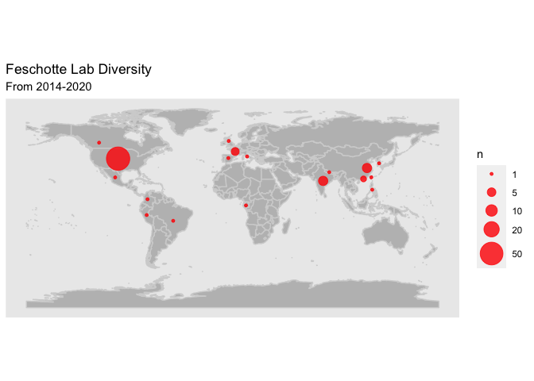
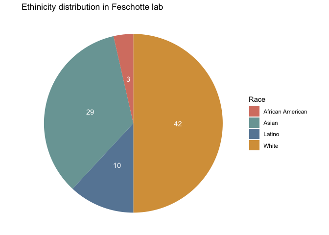

Feschotte lab diversity
================

Read csv and load libraries
===========================

``` r
suppressPackageStartupMessages(library(tidyverse))
suppressPackageStartupMessages(library(knitr))
library(ggplot2)
lab <- read_csv("Lab_members_stats_Feschotte.csv")
lab
```

Create a world map
==================

``` r
library("rnaturalearth") # install.packages("rnaturalearth")
library("rnaturalearthdata") # install.packages("rnaturalearthdata")
library("rgeos") #install.packages("rgeos")
```

``` r
world <- ne_countries(scale = "medium", returnclass = "sf")
```

``` r
lab %>% 
  group_by(Country,lat,long) %>% 
  summarize(n=n()) %>% 
  ggplot() +
  geom_sf(data = world, color = "lightgrey", fill = "grey") +
  geom_point(aes(x=long, y=lat, size=n,color=6*n), color="red", fill="red", alpha=0.8, shape=21) +
  scale_size(range=c(1,10),breaks=c(1,5,10,20,50)) +
  labs(title= "Feschotte Lab Diversity", subtitle="From 2014-2020") +
  theme(panel.grid = element_blank()) +
  theme(axis.title.y = element_blank(), axis.title.x = element_blank())
```



### Gender distribution

``` r
mycols <-c("goldenrod2","palegreen4")
lab %>% group_by(Gender) %>% 
  summarize(count=n()) %>% 
  arrange(desc(Gender)) %>%
  mutate(lab.ypos = cumsum(count) - 0.5*count) %>% 
ggplot(lab, mapping=aes(x="", y=count, fill=Gender)) +
  geom_bar(stat="identity", width=1, alpha=0.8) +
  coord_polar("y", start=0) +
  theme(axis.text.x=element_blank())+
  scale_fill_manual(values = mycols) +
  geom_text(aes(y = lab.ypos, label =count), color = "white") +
  labs(title="Gender distribution in Feschotte lab") +
  theme_void()
```


### Ethnicity distribution in Feschotte lab

tidy up the PIs typo
====================

``` r
table(lab$Race)
```

    ## 
    ##   Asian   Black  Latina  Latino Latino?   white   White 
    ##      29       3       3       6       1       1      41

``` r
lab_ethnicity <- lab %>% 
  mutate(Race= ifelse(Race == "white", "White", Race)) %>% 
  mutate(Race= ifelse(Race == "Latino?", "Latino", Race)) %>% 
  mutate(Race= ifelse(Race == "Latina", "Latino", Race))
table(lab_ethnicity$Race)
```

    ## 
    ##  Asian  Black Latino  White 
    ##     29      3     10     42

``` r
mycols2 <-c("coral3","darkslategray4","steelblue4","orange3")
lab_ethnicity %>% group_by(Race) %>% 
  summarize(count=n()) %>% 
  arrange(desc(Race)) %>%
  mutate(lab.count = cumsum(count) - 0.5*count) %>% 
ggplot(mapping=aes(x="", y=count, fill=Race)) +
  geom_bar(stat="identity", width=1, alpha=0.8) +
  coord_polar("y", start=0) +
  theme(axis.text.x=element_blank())+
  scale_fill_manual(values = mycols2) +
  geom_text(aes(y = lab.count, label =count), color = "white") +
  labs(title="Ethinicity distribution in Feschotte lab") +
  theme_void()
```


